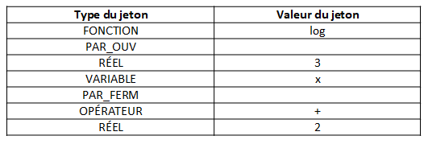
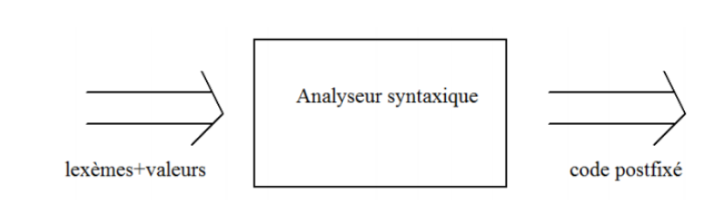
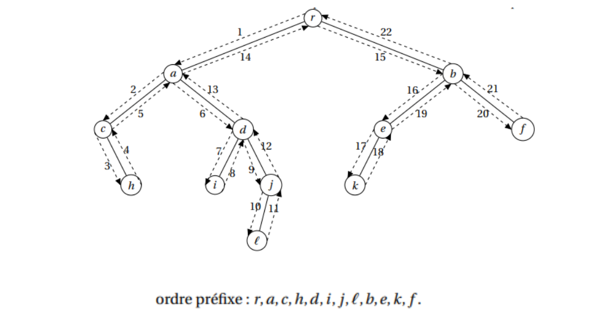
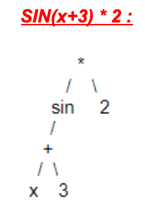
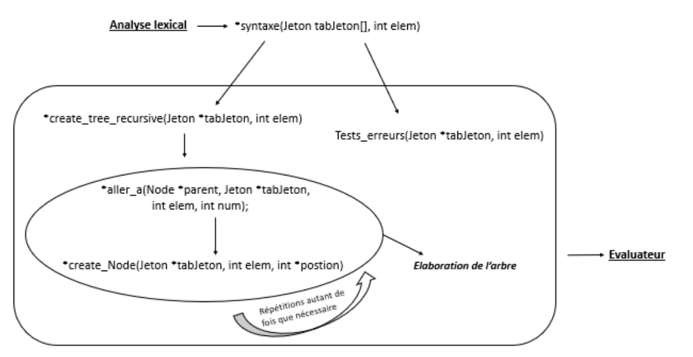
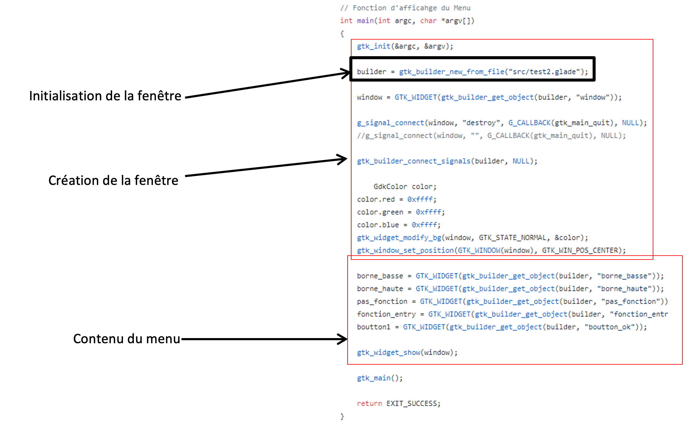
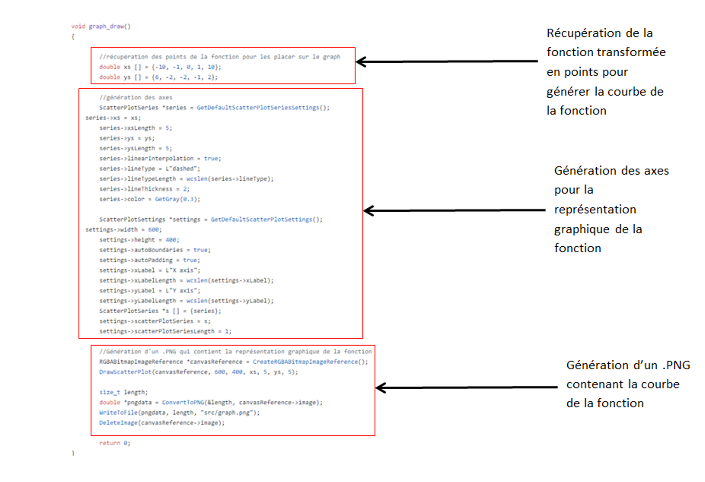
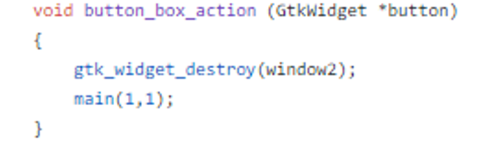
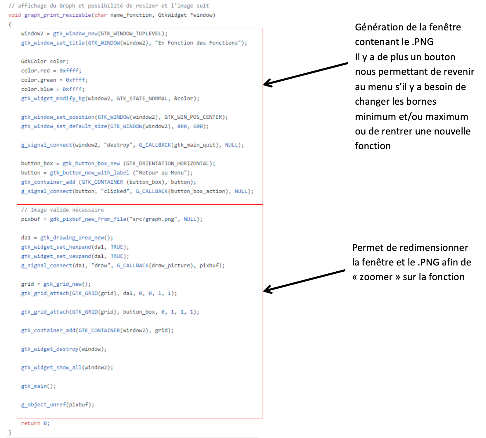

Bienvenue dans la partie code explained !

Dans cette partie on vous explique comment fonctionne d'un point de vue logique et d'un point de vue code l'afficheur de courbe.

## Analyse Lexicale :
Members : Killian Baert & Maxence Dhaynaut

Notre partie, intitulée « Analyse Lexicale », consiste à récupérer la fonction entrée par l’utilisateur et analyser chaque partie de son contenu afin de le transmettre à l’analyse syntaxique.

L’utilisateur peut rentrer des fonctions (log, exponentielle, valeur absolue, cosinus, sinus etc…), des paranthèses (afin de fournir les priorités de calcul), des opérateurs (+, -, *, /, ^) mais aussi des variables ou des réels. Tous ces éléments sont appelés des « jetons » et sont insérés dans un tableau.

Un jeton est une structure contenant le type de celui-ci (fonction, réél, etc…) et sa valeur (log, 1, a, etc…).

Exemple pour la fonction « log(3x) + 2 » :

## Analyse Syntaxique :
Members : Lucas Bremard & Benjamin Chane-Law

L’objectif de notre partie est de traiter un flux de couples lexèmes et de valeurs en entrée. Notre rôle est de vérifier la conformité de l'expression avec la grammaire définie et de produire en sortie un flux en forme d’arbre binaire.

1. Détection d’erreur possible

Nous recevons en entrée un tableau de jetons et sa longueur transmis par l’analyse lexicale. Notre premier objectif est d’analyser ce tableau et vérifier la syntaxe entrée par l’utilisateur. Si une erreur de syntaxe est repérée, nous envoyons à la partie évaluateur un message d’erreur accompagné de son code erreur, ces informations vont lui permettre d’effectuer les corrections nécessaires.

Les erreurs de syntaxe que nous traitons sont les suivantes :

-    erreur 100 : une division par 0 est impossible.
-    erreur 102 : une parenthèse ‘(‘ est manquante.
-    erreur 103 : une parenthèse ‘)’ est manquante.
-    erreur 104 : deux opérateurs sont avoisinants.
-    erreur 107 : barre d’une valeur absolue est manquante.
-    erreur 109 : un opérateur entre parenthèses est manquant.

Si aucune erreur n’est détectée, notre partie consiste à décomposer l’expression reçue par l’utilisateur pour débuter la création de l’arbre binaire.

2. Création de l’arbre

Concernant sa construction, nous parcourons l’arbre dans l’ordre “préfixe”. Voici une illustration permettant d’expliquer le parcours d’un arbre dans l’ordre préfixe : 

A chaque nœud, nous identifions l’élément.
Par exemple, reprenons le schéma ci-dessus : 

Si “r” a pour valeur “+”, nous attribuons au nœud correspondant, le lexem “Opérateur” et la valeur “PLUS”.

Le fonctionnement est le même pour chaque jeton récupéré dans le tableau transmis par l’analyse lexicale.
    
Pour construire l’arbre, nous fabriquons d’abord les branches de gauche. Lorsque nous arrivons sur une feuille (fin de la branche), nous affectons bien évidemment sa valeur (soit une variable ou soit un réel), et nous remontons d’un niveau pour nous intéresser à la partie droite de la branche sur laquelle nous nous trouvons.
Sur l’exemple ci-dessus, cette remontée correspond à l’étape 4-5-6.

Nous répétons ce fonctionnement autant de fois que possible jusqu’à ce que nous nous trouvons à l’étape 20. Une fois la dernière branche créée, nous remontons jusqu'à la racine.

Plus précisément, nous décomposons une fonction qui nous est donnée par la partie lexicale. Cette fonction est en réalité un tableau de Jeton qui peut prendre plusieurs valeurs :

lexem : attribut caractérisant la valeur du jeton. En fonction de ce qu’il vaut, les autres attributs seront définis différemment.
fonction : la valeur de la fonction (SIN, COS, TAN, ABS, …)
opérateur : la valeur de l’opérateur (PLUS, MOINS, FOIS, DIV, …)
erreur : la valeur de l’erreur ("Erreur 100 : division zéro", "Erreur 102 : parenthèse non ouverte", ...)
réel : un réel

Notre programme est capable de détecter précisément le “caractère” qui sera la racine de notre arbre binaire ainsi que les branches qui le suit, comme le démontre l’exemple suivant :

Implémentation:

Tout d’abord, pour créer l’arbre, nous examinons d’abord le tableau de jetons reçu de l’analyse lexical. Puis, nous déterminons l’opérande le moins prioritaire dans l’expression, la fonction en lui-même ou encore la variable/le réel. Tout cela dépendra de l’expression que nous traitons.
La fabrication des différents nœuds de l’arbre se fait de manière récursive. En effet, comme nous l’avons dit précédemment, nous réalisons cet arbre en respectant l’ordre préfixe. La “remontée” de la branche s’effectue lorsque la valeur trouvée, sur le nœud actuel, est un réel ou une variable: cela signifie donc que l’on se trouve sur une feuille (fin de chaîne).
Tous les nœuds étant liés, la navigation peut s’effectuer aisément.
Enfin, lors de la complétion de l’arbre, nous pouvons facilement savoir notre emplacement grâce aux coordonnées du nœud (exprimé en couche et en colonne).

3. Envoi vers la partie évaluateur

Dans un premier temps, nous envoyons à la partie évaluateur un message d’erreur ainsi que son code erreur si un problème de syntaxe est repéré.
Dans un second temps, si la fonction entrée par l’utilisateur est correcte, nous construisons l’arbre binaire dans l’ordre préfixe comme expliqué précédemment. Une fois la construction de l’arbre effectuée, nous envoyons à la partie évaluateur l’arbre binaire dans sa totalité. L’arbre binaire peut être parcouru de sa racine vers chacunes de ses feuilles.

## Evaluateur :
Members : Louis-Marie Bossard & Valentin Hecht

La partie Evaluateur permet de decomposer l'arbre envoyé par la partie syntaxe (apres la vérification des erreurs eventuelles). On execute ensuite des calcul a l'aide de SWTICH afin de détecter les différents lexems de chaque jetons : fonctions, opérateurs, réels ou variables. Nous procédons de la même manière pour différencier les fonctions et opérateurs. Une fois le premier jeton évalué, nous rappelons la fonction de manière récursive afin de traiter tous les jetons. Cette récursivité est possible grâce aux éléments jetons pjetonpreced et pjetonsuiv présents dans les différentes nodes. Les valeurs de x et f(x) sont ensuite envoyées dans un tableau qui permettra a la partie graphique de tracer la courbe.

Ce tableau renvoyé est alors de N lignes pour N valeurs de X et de 2 colones, une X et une f(x).

## Partie graphique :
Members : Romain Larramendy & Thomas Tissier

Nous avions pour but de créer une interface permettant à l’utilisateur de rentrer une fonction et de gérer l’interface ou la représentation graphique de la fonction doit être affichée.
Pour réaliser les interfaces nous nous sommes d’abord orientés vers la librairie « OpenGL » que nous avons laissé par la suite pour « Raylib » suite à quelques difficultés.
Ayant également quelques soucis avec « Raylib », nous avons finalement opté pour la librairie « GTK ».

Avec « GTK » nous avons pu modéliser un menu pour que l’utilisateur rentre une fonction en utilisant le code suivant à l’aide de l’outil Glade:

Pour réaliser le menu ou l’utilisateur doit rentrer sa fonction nous avons divisé le code en 3 parties

On récupère les données de la fonction, que l’on va récupérer dans le « void graph_draw( ) »
Cela nous permets de générer la courbe de la fonction qu’on va ensuite convertir en .PNG qui sera affiché dans une nouvelle fenêtre.

Une fois ces étapes fini, on clôture notre première fenêtre à l’aide du code suivant :

Il ne nous reste plus qu’à générer une nouvelle fenêtre affichant notre .PNG :

