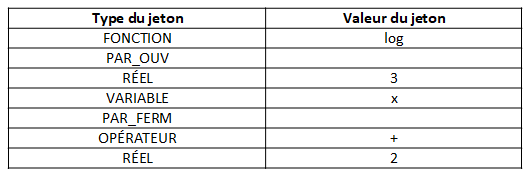

Bienvenue dans la partie code explained !

Dans cette partie on vous explique comment fonctionne d'un point de vue logique et d'un point de vue code la partie analyse lexicale.

Members : Killian Baert & Maxence Dhaynaut

Notre partie, intitulée « Analyse Lexicale », consiste à récupérer la fonction entrée par l’utilisateur et analyser chaque partie de son contenu afin de le transmettre à l’analyse syntaxique.

L’utilisateur peut rentrer des fonctions (log, exponentielle, valeur absolue, cosinus, sinus etc…), des paranthèses (afin de fournir les priorités de calcul), des opérateurs (+, -, *, /, ^) mais aussi des variables ou des réels. Tous ces éléments sont appelés des « jetons » et sont insérés dans un tableau.

Un jeton est une structure contenant le type de celui-ci (fonction, réél, etc…) et sa valeur (log, 1, a, etc…).

Exemple pour la fonction « log(3x) + 2 » :

